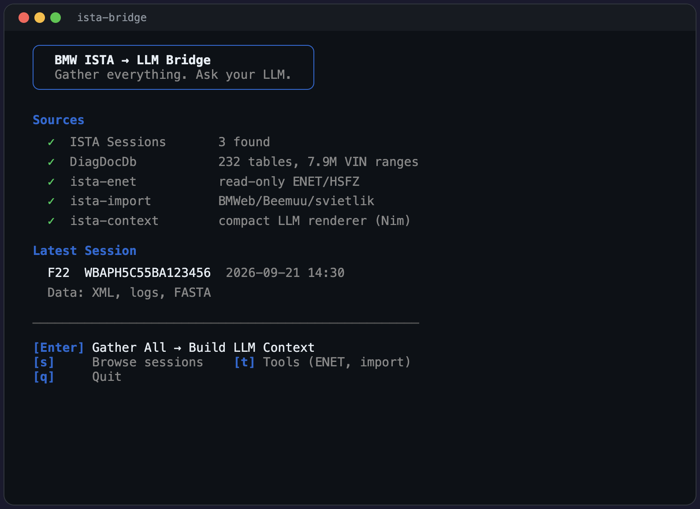
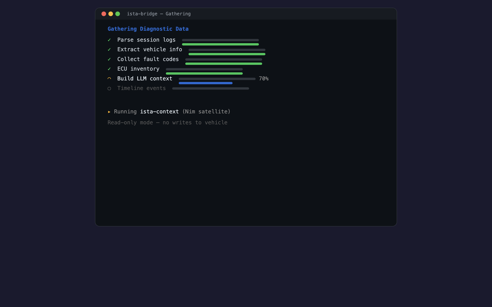
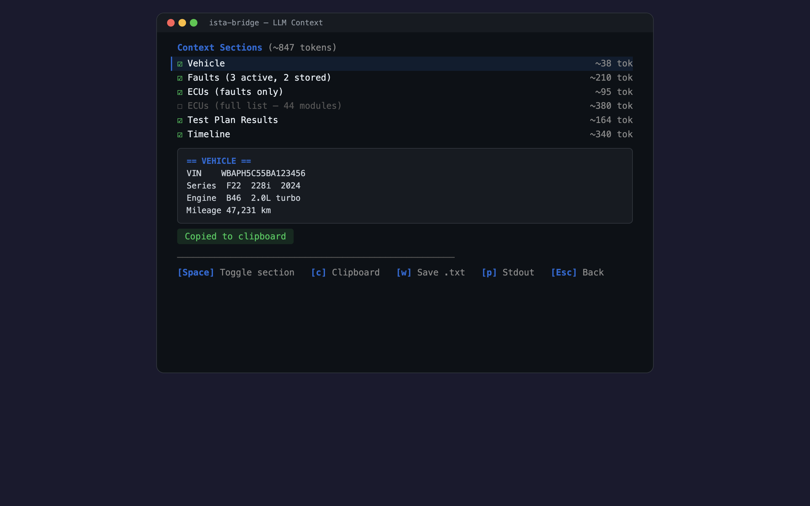

<p align="center">
  <h1 align="center">ista-bridge</h1>
  <p align="center">
    Capture BMW ISTA diagnostic sessions and package them for LLM-assisted vehicle troubleshooting.
  </p>
</p>

<p align="center">
  <a href="https://go.dev"></a>
  <a href="LICENSE"></a>
  <a href="https://microsoft.com/windows"></a>
  <a href="https://ffmpeg.org"></a>
  <a href="https://aomediacodec.github.io/av1-avif/"></a>
</p>

<p align="center">
  <strong>Quality & Testing</strong><br>
  
  
  
  
</p>

<p align="center">
  <strong>BMW Integration</strong><br>
  
  
  
  
  
</p>

<p align="center">
  <strong>Hardware Acceleration</strong><br>
  
  
  
  
</p>

<p align="center">
  <strong>TUI & Capture</strong><br>
  
  
  
  
</p>

<p align="center">
  <strong>Satellite Architecture</strong><br>
  
  
  
  
  
</p>

<p align="center">
  <strong>Vehicle Safety</strong><br>
  
  
  
  
</p>

---

## What is this?

<p align="center">
  
</p>

**ista-bridge** is an LLM bridge for BMW diagnostics. It gathers everything — ISTA session data, live vehicle faults over ENET, DiagDocDb lookups, imported scans from other tools — and compresses it into a compact, token-efficient context that fits any LLM's context window. One key press gathers, one key press copies to clipboard, then paste into Claude or ChatGPT and ask *"what's wrong with my car?"*

The `ista-context` satellite (Nim) is the bridge brain: it reads session bundles and renders ~800–1200 token diagnostic summaries with per-section token estimates and budget targeting. Vehicle, faults, ECUs, tests, timeline — all actionable, no wasted tokens. The `ista-enet` satellite reads fault codes and ECU data directly from the car over ENET (strictly read-only, writes hard-blocked at protocol layer). The `ista-import` satellite ingests scans from BMWeb, Beemuu, svietlik, and klartext.

### The problem

BMW ISTA is dealer-level diagnostic software. It reads fault codes, shows ECU trees, runs guided troubleshooting, and displays wiring diagrams — but everything is locked inside a WPF desktop GUI. There's no export button, no API, no JSON. The main database (`DiagDocDb.sqlite`) is encrypted. If you want an LLM to help you diagnose your car, you'd have to manually screenshot everything and type out the fault codes.

### The solution

Run ISTA, diagnose your car, and **ista-bridge** does four things:

1. **Captures screenshots** every time the ISTA screen changes (AVIF, ~30-50 KB each)
2. **Parses ISTA's XML session files** to extract structured vehicle data
3. **Queries DiagDocDb** — decrypts the 7 GB database for VIN ranges, fault codes, P-codes, and diagnostic data
4. **Bundles everything** into a clean package you can feed to an LLM

Then you paste `summary.md` into Claude or ChatGPT and ask *"what's wrong with my car?"* — with full context.

### Gather & Build Context

<p align="center">
  
</p>

### Context View — Toggle Sections, Copy to LLM

<p align="center">
  
</p>

---

## Quick Start

### Prerequisites

| Requirement | Why |
|---|---|
| **Windows 10/11** | ISTA is Windows-only; ista-bridge uses Win32 APIs (macOS/Linux: `--demo` mode available) |
| **Go 1.27+** | Build the main binary |
| **FFmpeg** | AVIF screenshot encoding ([download](https://ffmpeg.org/download.html), add to PATH) |
| **BMW ISTA** | The diagnostic software itself (installed at `C:\EC-APPS\ISTA\`) |

**Optional satellite tool compilers** (for faster offline lookups):

| Compiler | Satellite Tools | Purpose |
|---|---|---|
| [Nim](https://nim-lang.org/) | `ista-context`, `ista-report`, `ista-enet`, `ista-import` | LLM context builder, report rendering, read-only ENET diagnostics, multi-format data import |
| [Gleam](https://gleam.run/) | `ista-faultlookup` | Fault code / P-code search |
| [Zig](https://ziglang.org/) | `ista-vinlookup` | VIN decoding via binary search |
| [Odin](https://odin-lang.org/) | `ista-keyextract` | .NET PE/CLI key extraction |

Without the satellite tools, all features still work via the PowerShell database bridge — the satellites just make lookups faster and work offline. The `ista-context`, `ista-enet`, and `ista-import` tools provide new capabilities (compact LLM context, live vehicle reads, multi-source import) that have no Go fallback. Nim is the most important compiler to install.

> **Language policy:** New code is written in **Nim** (preferred), Gleam, Zig, or Odin — never Go. Go is the thin orchestrator/TUI shell only.

### Install

```bash
git clone https://github.com/ista-tools/ista-bridge.git
cd ista-bridge
go build -o ista-bridge.exe .
```

Single binary, no runtime dependencies.

### Build everything (with Makefile)

```bash
# Build Go binary + all Nim satellites (report, enet, import)
make build

# Build individual satellite tools
make nim          # All Nim tools (context, report, enet, import)
make nim-context  # LLM context builder
make nim-report   # Report generator only
make nim-enet     # ENET diagnostic client only
make nim-import   # Multi-format importer only
make gleam        # Fault code lookup
make zig          # VIN decoder

# Clean all build artifacts
make clean
```

### Basic Usage

```bash
# Launch the interactive TUI (recommended)
ista-bridge.exe

# Preview TUI on macOS/Linux (mock data, no Windows required)
ista-bridge --demo

# Or use individual commands directly:

# 1. Start ISTA and connect to your car

# 2. In another terminal, start capturing
ista-bridge.exe watch

# 3. Do your diagnostic work in ISTA (read faults, run tests, etc.)
# ista-bridge silently captures every screen change

# 4. Press Ctrl+C when done

# 5. Bundle the session for an LLM
ista-bridge.exe bundle

# Or bundle and copy summary.md to clipboard in one step
ista-bridge.exe bundle -clipboard

# 6. Open summary.md and paste it into Claude/ChatGPT
```

---

## Commands

### `ista-bridge` (Interactive TUI)

Running with no arguments launches the interactive terminal UI:

```bash
ista-bridge.exe
```

The TUI provides a dashboard with system status, capture stats, and keyboard-driven access to all features.

On **macOS/Linux**, run `ista-bridge --demo` for a preview with mock data — all views are functional, just with simulated vehicle/session data instead of live ISTA.

Keys:

The TUI is oriented around the bridge workflow: **gather → build context → copy to LLM**.

| Key | Action |
|---|---|
| `Enter` | **Gather All** — collect every data source and build compact LLM context |
| `s` | Browse ISTA diagnostic sessions |
| `t` | Tools — secondary features (live ENET, import) |
| `q` | Quit |

**Context view** (after gathering):

| Key | Action |
|---|---|
| `Space` | Toggle section on/off (adjusts token count in real-time) |
| `c` | Copy context to clipboard — ready to paste into your LLM |
| `w` | Save context to file (`context.txt`) |
| `p` | Print to stdout and exit (pipeable: `ista-bridge \| clip`) |
| `↑↓` | Navigate sections |
| `Esc` | Back to dashboard |

The context view shows per-section token estimates and a live preview. Toggle sections to fit your LLM's context window — faults and vehicle info are always included, full ECU list and timeline are optional.

### `ista-bridge watch`

Captures ISTA screenshots in real-time.

```bash
ista-bridge.exe watch [flags]
```

| Flag | Default | What it does |
|---|---|---|
| `-window` | `ISTA` | Window title to match (substring, scored matching) |
| `-poll` | `200ms` | How often to check for screen changes |
| `-debounce` | `400ms` | Wait time after a change before capturing (lets animations settle) |
| `-threshold` | `0.005` | Minimum pixel change to trigger a capture (0.5%) |
| `-quality` | `14` | Encoder CRF — lower number = higher quality |
| `-preset` | `4` | Encoder speed — lower = slower but better compression |
| `-out` | `screenshots` | Where to save captures |

**How change detection works:**

1. **pHash pre-filter** (~4ms) — perceptual hash rejects obviously-unchanged frames
2. **Pixel diff** — 64-bit block comparison counts changed pixels (see [Hardware Acceleration](#hardware-acceleration))
3. **Debounce** — waits for the screen to stop changing before capturing

### `ista-bridge sessions`

Lists all ISTA diagnostic sessions found on this machine.

```
$ ista-bridge.exe sessions
Found 2 session(s):

  1. 2025-03-15 09:22  VIN: WBAXXXXXXXX00000  Model: G20
     ✓ Transaction data
     ✓ Log bundle (.zip.log)
     ✓ FASTA behavioral data
     ✓ FASTA test data

  2. 2025-03-10 14:05  VIN: WBAXXXXXXXX00000  Model: F30
     ✓ Transaction data
     ✓ FASTA test data
```

Sessions are discovered by scanning ISTA's `Transactions/` directory for XML files that ISTA writes automatically after every diagnostic session. Correlated files (RG_META, RG_TRANS, RG_PRG, zip.log, FASTAOut .behdat/.fstdat) are automatically associated by VIN and timestamp.

### `ista-bridge bundle`

Packages a session into LLM-ready files.

```bash
ista-bridge.exe bundle [-out DIR] [-session YYYY-MM-DD]
```

| Flag | Default | What it does |
|---|---|---|
| `-out` | `screenshots` | Where to create the bundle folder |
| `-session` | *(latest)* | Specific session date to bundle |
| `-clipboard` | `false` | Copy summary.md contents to system clipboard after bundling |

**Output structure:**

```
session_2025-03-15_092200_WBAXXXXXXXX00000/
├── summary.md        ← Feed this to Claude/ChatGPT (generated by Nim)
├── vehicle.json      ← VIN, model, engine, I-level, mileage
├── ecus.json         ← Full ECU list with software versions
├── faults.json       ← All fault codes with status and context
├── ecukom.json       ← EDIABAS job results from zip.log (if available)
├── timeline.json     ← Session flow events from IstaOperation.log (if available)
├── tests.json        ← FASTA test results — pass/fail per test (if available)
└── screenshots/      ← AVIF captures from the session
```

**What's in each file:**

| File | Contents | Typical Size |
|---|---|---|
| `summary.md` | LLM-optimized Markdown overview — vehicle, faults, ECUs, tests, timeline | ~3-10 KB |
| `vehicle.json` | VIN, brand, model series, engine, transmission, I-level, mileage, market | ~0.5 KB |
| `ecus.json` | Every ECU: name, variant, bus, protocol, supplier, software IDs, fault count | ~5-15 KB |
| `faults.json` | Every DTC: code, description, status (active/stored), warning lamp, mileage | ~1-5 KB |
| `ecukom.json` | Every EDIABAS job sent to every ECU with results (from zip.log) | ~50-500 KB |
| `timeline.json` | Key session events: connect, identify, fault read, errors (from IstaOperation.log) | ~5-20 KB |
| `tests.json` | FASTA test results: test name, pass/fail/skipped status | ~2-10 KB |
| `screenshots/` | Chronological AVIF captures of the ISTA GUI | ~30-50 KB each |

The `summary.md` is generated by the Nim-based `ista-report` tool (delegated via Go's satellite orchestrator). It includes a vehicle table, session stats, fault codes, FASTA test results, session timeline, and the full ECU list — all in a format optimized for LLM context windows.

### `ista-bridge vin <vin>`

Decode a VIN using the DiagDocDb VINRANGES table (7.9M records).

```bash
# Full 17-digit VIN — matches by positions 4-7 and sequential range
ista-bridge.exe vin WBAPH5C55BA123456

# Just positions 4-7 (model/type code)
ista-bridge.exe vin JB1C

# JSON output
ista-bridge.exe vin WBAPH5C55BA123456 --json
```

Uses the Zig-based `ista-vinlookup` binary for microsecond sorted binary search over exported VINRANGES data. Falls back to DiagDocDb via PowerShell bridge if lookup data hasn't been exported or the Zig tool isn't built.

### `ista-bridge lookup <type> <search>`

Search DiagDocDb for fault codes, P-codes, Check Control messages, and diagnostic codes.

```bash
# P-code lookup
ista-bridge.exe lookup pcode P0300

# BMW fault code
ista-bridge.exe lookup fault 48291

# Check Control messages (text search)
ista-bridge.exe lookup cc "engine oil"

# Diagnostic code search
ista-bridge.exe lookup diag "DME"

# Fault by database ID
ista-bridge.exe lookup fault-id 12345

# Raw JSON output
ista-bridge.exe lookup pcode P0420 --json
```

Uses the Gleam-based `ista-faultlookup` tool for pcode/fault searches when exported data is available. Falls back to DiagDocDb for cc/diag/fault-id lookups or when the Gleam tool isn't built.

### `ista-bridge report [date]`

Generate a diagnostic report from an ISTA session. Delegates all rendering to the Nim-based `ista-report` tool.

```bash
# Latest session — Markdown
ista-bridge.exe report

# Specific date
ista-bridge.exe report 2026-09-20

# HTML report (standalone, light/dark theme, print-friendly)
ista-bridge.exe report --html

# Both Markdown and HTML
ista-bridge.exe report 2026-09-20 --html
```

**Report formats:**

| Format | Output | Description |
|---|---|---|
| Markdown | `report.md` | Full diagnostic report with tables for vehicle, faults, ECUs, software versions, FASTA tests, and timeline |
| HTML | `report.html` | Self-contained single-file HTML with embedded CSS (light/dark theme), stat cards, pass/fail badges, base64-inlined screenshots, and print-friendly styling |
| Summary | `summary.md` | LLM-optimized condensed overview (used by `bundle` command) |
| Text | stdout | Plain-text report for terminal viewing |

The HTML report includes vehicle info, fault codes (sorted safety-first by weighting), FASTA test results with pass/fail/skipped badges, session timeline with error/warning highlighting, ECU list with communication status, software versions, and inline screenshots — all in a single `.html` file with no external dependencies.

### `ista-bridge db <subcommand>`

Direct access to the encrypted DiagDocDb (232 tables).

```bash
ista-bridge.exe db tables              # List all tables
ista-bridge.exe db schema VINRANGES    # Show table columns
ista-bridge.exe db count XEP_FAULTCODES # Row count
ista-bridge.exe db query "SELECT ..."  # Raw SQL
ista-bridge.exe db export VINRANGES    # Export table as JSON
ista-bridge.exe db export-all db-export # Export all tables
ista-bridge.exe db export-lookup       # Export lookup data for satellite tools
```

The `export-lookup` subcommand exports fault codes, P-codes, and VIN ranges from DiagDocDb into JSON files that the Gleam and Zig satellite tools consume for offline lookups.

### `ista-bridge odincs <dll-or-directory>`

Extract .NET assembly public key tokens from DLLs — useful for discovering database encryption keys.

```bash
ista-bridge.exe odincs C:\EC-Apps\ISTA\TesterGUI\bin\Release\ISTAGUI.exe
```

Delegates to the Odin-based `ista-keyextract` tool, which performs native PE/CLI binary parsing without a .NET runtime.

### `ista-enet` (Satellite — Nim)

Read-only diagnostic client for BMW F-series vehicles over ENET/HSFZ.

**Non-interference guarantees:**
- **Write operations are hard-blocked at the protocol layer** — they raise `SafetyError` before serialization and never reach the wire.
- **Will NOT connect if ISTA is running.** Before connecting, ista-enet checks for ISTAGUI.exe and IstaServicesHost.exe processes. If either is detected, it refuses to connect — ISTA owns the diagnostic session and connecting simultaneously could corrupt its active communication with the vehicle.
- **Uses tester address 0xF5** (ISTA uses 0xF4) so even in `--force` mode, UDS response routing stays separate.
- **Cleans up on disconnect** — every ECU switched to extended diagnostic session is returned to default session before the connection closes.

```bash
# Read faults from DME (engine ECU)
ista-enet.exe faults --json

# Read faults from a specific ECU
ista-enet.exe faults --ecu 0x56 --json

# Scan for available ECUs
ista-enet.exe ecus --json

# Read a specific data identifier
ista-enet.exe data --ecu 0x00 --did 0xF190

# Read VIN
ista-enet.exe vin --json

# Specify car IP (default: 169.254.0.10)
ista-enet.exe faults --host 169.254.0.1 --json
```

| Flag | Default | What it does |
|---|---|---|
| `--host` | `169.254.0.10` | Car ENET IP address |
| `--port` | `6801` | ENET port |
| `--ecu` | `0x00` | ECU address (hex) |
| `--did` | `0xF190` | Data identifier (hex, for `data` command) |
| `--tester` | `0xF5` | Tester logical address (deliberately different from ISTA's 0xF4) |
| `--json` | false | JSON output for orchestrator integration |
| `--force` | false | Connect even if ISTA is running (**not recommended**) |

**Blocked UDS services** (raise `SafetyError` before serialization):
`ClearDiagnosticInformation (0x14)`, `WriteDataByIdentifier (0x2E)`, `InputOutputControlByIdentifier (0x2F)`, `RoutineControl (0x31)`, `RequestDownload (0x34)`, `RequestUpload (0x35)`, `TransferData (0x36)`, `RequestTransferExit (0x37)`, `WriteMemoryByAddress (0x3D)`, `CommunicationControl (0x28)`, `ControlDTCSetting (0x85)`.

### `ista-import` (Satellite — Nim)

Imports diagnostic scans from other BMW tools and normalizes them into the ista-bridge bundle format. Auto-detects source format from JSON structure.

```bash
# Import a BMWeb scan
ista-import.exe --bmweb scan.json --out my_bundle

# Import a Beemuu snapshot
ista-import.exe --beemuu snapshot.json --out my_bundle

# Import a svietlik module scan
ista-import.exe --svietlik modules.json --out my_bundle

# Auto-detect format
ista-import.exe --auto unknown.json --out my_bundle

# Merge multiple sources into one bundle
ista-import.exe --bmweb scan.json --beemuu snapshot.json --out merged_bundle

# JSON to stdout (for orchestrator)
ista-import.exe --auto scan.json --json
```

Each record in the output is tagged with a `data_source` field so you (and the LLM) know where each data point came from.

### `ista-context` (Satellite — Nim)

The bridge brain. Reads session bundle JSONs and produces a compact, token-efficient diagnostic context optimized for LLM consumption. Every token earns its place.

```bash
# Build the compact context from a session bundle
ista-context --data-dir ./session_2026-09-21_WBAPH5C55BA123456/

# JSON output (for Go orchestrator / TUI)
ista-context --data-dir ./session_.../ --json

# Target a token budget — auto-trims to fit
ista-context --data-dir ./session_.../ --budget 1500

# Include full ECU list (default: only ECUs with faults)
ista-context --data-dir ./session_.../ --full-ecus

# Pipe directly to clipboard
ista-context --data-dir ./session_.../ | pbcopy   # macOS
ista-context --data-dir ./session_.../ | clip      # Windows
```

**Output format** — compact, structured, every token counts:

```
# BMW F22 228i N20/AUT — WBAPH5C55BA123456
2014 | 45,230 km | I-Level: F020-15-11-502 | via ENET | ECE

## 6 Faults (2 active, 4 stored)
ACTIVE  DME    0048029A  P0300   Random/multiple cylinder misfire detected
ACTIVE  DSC    00480246  —       ABS wheel speed sensor front left
STORED  DME    004812A0  P0171   System too lean, bank 1
...

## ECUs: 3/38 with faults
DME    KCAN   Bosch      MEVD17.2.G  2 fault(s)
DSC    KCAN   Continental MK100       2 fault(s)
[+35 ECUs — all OK]

## Tests: 10 passed, 2 failed
FAIL  Brake pad wear — front pads 2.1mm (min 3mm)
FAIL  Battery capacity — 58% (min 70%)
[+10 more passed]
```

A typical session compresses to **~800–1200 tokens** — small enough for any LLM context window while retaining all actionable diagnostic data.

---

## DiagDocDb Access

The `DiagDocDb.sqlite` database (7.6 GB, 232 tables, 7.9M VIN ranges) is encrypted with SQLite SEE (Encryption Extension). The encryption key is the uppercase public key token of the Rheingold assembly's strong name signing key.

**How it works:**
1. The 32-bit `SQLite.Interop.dll` requires an x86 process to load
2. ista-bridge spawns a 32-bit PowerShell process (`SysWOW64\powershell.exe`)
3. PowerShell loads `System.Data.SQLite.dll` and opens the DB with the key
4. Results come back as JSON

The key can be extracted automatically from any ISTA DLL using the `odincs` command, or stored in a key file at `%USERPROFILE%\Desktop\ista_keys.txt`.

---

## The Right Language for the Right Job

Each component uses the language best suited to its task. Go orchestrates the system and provides the TUI, but the heavy lifting is delegated to purpose-built satellite tools:

| Tool | Language | Why this language |
|---|---|---|
| `ista-bridge` | **Go** | Thin orchestrator shell — Win32 capture, TUI, satellite discovery, CLI routing. No business logic — that lives in satellites |
| `ista-context` | **Nim** | The bridge brain — reads session bundles and renders compact, token-efficient diagnostic context optimized for LLM consumption. Per-section token estimation, budget targeting, structured JSON output for orchestrator |
| `ista-report` | **Nim** | All report rendering — Markdown, HTML (with base64-inlined screenshots and light/dark CSS), text, and LLM-optimized summaries |
| `ista-enet` | **Nim** | Read-only ENET/HSFZ diagnostic client — TCP protocol, UDS read services, hard-blocked writes at protocol layer |
| `ista-import` | **Nim** | Multi-format data importer — normalizes BMWeb, Beemuu, svietlik, and klartext JSON exports into the ista-bridge bundle format with data provenance tagging |
| `ista-faultlookup` | **Gleam** (Erlang/BEAM) | Pattern matching and immutable data — Gleam's type-safe functional style is a natural fit for filtering and searching across fault code datasets with JSON output |
| `ista-vinlookup` | **Zig** | Performance-critical search — Zig's zero-overhead sorted binary search over 7.9M VIN ranges runs in microseconds with no GC pauses |
| `ista-keyextract` | **Odin** | Low-level PE/CLI binary parsing — Odin's manual memory control and bit manipulation make it ideal for walking .NET metadata tables and computing SHA-1 key tokens without a runtime |

### How satellite orchestration works

Go discovers satellite tool binaries at runtime via the orchestrator (`orchestrate.go`). For each tool, it searches:
1. The directory containing the `ista-bridge` binary
2. The tool's `tools/` subdirectory relative to the binary
3. The current working directory and its `tools/` subdirectory
4. The system `PATH`

If a satellite binary is found:
- `gather` / bridge TUI → call `ista-context` (Nim) for compact LLM context building
- `report` / `bundle` commands → call `ista-report` (Nim) for all Markdown, HTML, and summary generation
- `live` commands → call `ista-enet` (Nim) for read-only ENET/HSFZ vehicle diagnostics
- `import` commands → call `ista-import` (Nim) for multi-format data ingestion
- `vin` command → call `ista-vinlookup` (Zig) for fast binary search over exported VIN data
- `lookup pcode/fault` → call `ista-faultlookup` (Gleam) for pattern matching over exported fault data
- `odincs` command → call `ista-keyextract` (Odin) for native PE parsing

If a satellite tool isn't built, Go falls back to its PowerShell database bridge for queries. The `db export-lookup` command exports the DiagDocDb data to JSON files that the satellite tools consume. The `ista-context`, `ista-enet`, and `ista-import` tools provide new capabilities (compact LLM context, live vehicle reads, multi-source import) that have no Go fallback.

> **Language policy:** All new code is written in Nim (preferred), Gleam, Zig, or Odin — never Go. Go is the thin orchestrator shell only.

Source code is in the `tools/` directory.

---

## Session Data Pipeline

ista-bridge parses and correlates six different data sources from a single diagnostic session:

```
ISTA Session
│
├── RG_META_*.xml ─────── Vehicle identity (model, engine, year, market, mileage)
├── RG_TRANS_*.xml ────── ECU list, fault codes, I-level, software versions
├── RG_PRG_*.xml ─────── Programming session data (if coding/flashing was done)
├── *.behdat ──────────── FASTA behavioral data (session actions, page navigation)
├── *.fstdat ──────────── FASTA test results (pass/fail/skipped per test)
└── *.zip.log ─────────── Complete log bundle (actually a ZIP):
    ├── IstaOperation.log ── Session timeline (key events extracted)
    ├── <VIN>_<Model>.xml ── ECUKom (every EDIABAS job with raw responses)
    ├── psdz_Default.log ─── PSdZ programming default log
    ├── psdz.log ──────────── PSdZ programming log
    ├── ISTA.log ──────────── Application startup/config
    ├── RG_TRANS_*.xml ────── Transaction data (copy)
    ├── *.behdat ──────────── Behavioral data (copy)
    ├── PsdzServiceHost.log  PSdZ service host log
    ├── IstaServicesHost.log  WCF services host log
    └── [Content_Types].xml  Manifest
```

The timeline parser extracts key events from `IstaOperation.log` using regex patterns for session lifecycle, vehicle connection, ECU identification, fault operations, FASTA tests, programming, errors, VIN detection, I-level changes, battery/voltage, and communication events. Only INFO/WARN/ERROR level events matching these patterns are included.

The FASTA parser handles both German and English XML element names (e.g., `pruefschritt`/`teststep`, `ergebnis`/`result`, `bestanden`/`passed`) and normalizes results to `passed`/`failed`/`skipped`.

The ECUKom parser uses generic XML tree walking to extract EDIABAS job results across varying ISTA XML formats.

---

## Hardware Acceleration

ista-bridge uses hardware acceleration at two levels:

### Screenshot Encoding (GPU)

FFmpeg probes for hardware encoders in priority order and falls back gracefully:

| Priority | Encoder | Hardware | Notes |
|---|---|---|---|
| 1 | `av1_qsv` | Intel Quick Sync | Requires 11th-gen+ Intel CPU |
| 2 | `av1_nvenc` | NVIDIA NVENC | Requires RTX 40-series+ |
| 3 | `av1_amf` | AMD AMF | Requires RX 7000-series+ |
| 4 | `libaom-av1` | CPU | Best quality, slowest |
| 5 | `libsvtav1` | CPU | Good balance of speed/quality |
| 6 | `librav1e` | CPU | Rust-based AV1 encoder |
| 7 | `libwebp` | CPU | WebP fallback if no AV1 support |

The probe runs once at startup — a 64x64 test frame is encoded with each codec until one succeeds.

### Pixel Comparison (CPU SIMD)

The change-detection loop compares two full-resolution pixel buffers every poll cycle. The hot path uses **64-bit block comparison**:

- Processes **2 BGRA pixels per iteration** via `uint64` XOR
- Masks out alpha channels (`0x00FFFFFF00FFFFFF`)
- On **x86-64**, the Go compiler emits native 64-bit XOR ops; with AVX2 available, the tight loop can be auto-vectorized
- On **ARM64**, NEON instructions handle the 64-bit operations natively

This gives ~2-4x throughput vs. byte-by-byte comparison on a typical 1920x1080 ISTA window.

---

## ISTA Architecture (Reverse Engineered)

```
┌─────────────────┐     WCF binary      ┌──────────────────────┐
│   ISTAGUI.exe   │◄───────────────────►│  IstaServicesHost.exe │
│  (.NET 4 / WPF) │    port 64923       │     (.NET / WCF)      │
└────────┬────────┘                      └──────────┬───────────┘
         │                                          │
         │ Win32 UI                                 │ jni4net bridge
         │                                          │
         │                               ┌──────────▼───────────┐
         │                               │  PsdzServiceHost.exe  │
         │                               │      (Java / JRE)     │
         │                               └──────────┬───────────┘
         │                                          │
         │                                          │ Ediabas API
         │                                          │
         └──────────────────────┬───────────────────┘
                                │
                      DoIP / ISO 13400
                      TCP → 169.254.x.x:6801
                                │
                         ┌──────▼──────┐
                         │   Vehicle   │
                         │  (via ENET) │
                         └─────────────┘
```

**Key findings:**
- No REST API — the GUI and services communicate over WCF binary protocol (named pipes / TCP)
- Vehicle communication uses DoIP (Diagnostics over IP) per ISO 13400
- Each diagnostic operation opens a fresh TCP connection to the vehicle
- The `DiagDocDb.sqlite` (7 GB) is encrypted with SQLite SEE — key is the Rheingold assembly public key token
- The `xmlvalueprimitive_*.sqlite` databases are readable and contain diagnostic procedures as compressed XML with FTS5 search

---

## Configuration

Config lives at `%APPDATA%\ista-bridge\config.toml` — created on first run with sensible defaults.

```toml
[window]
title = "ISTA"                    # Window title to match

[capture]
poll_ms = 200                     # Check for changes every 200ms
debounce_ms = 400                 # Wait 400ms after change before capture
threshold = 0.005                 # 0.5% pixel change triggers capture
phash_threshold = 3               # Perceptual hash sensitivity (0-64)

[encoding]
quality = 14                      # CRF for AVIF (12-16 best for text)
preset = 4                        # Speed (0=slow/best, 6=fast)

[output]
directory = "screenshots"         # Base output directory
session_folders = true            # Create YYYY-MM-DD subdirectories

[logging]
level = "info"                    # debug | info | warn | error
max_size_mb = 10                  # Rotate at 10 MB
max_backups = 5                   # Keep 5 rotated files
max_age_days = 28                 # Delete after 28 days
compress = true                   # gzip rotated logs

[ista]
install_dir = 'C:\EC-APPS\ISTA'   # ISTA installation path
log_dir = 'C:\EC-APPS\ISTA\Logs'  # ISTA log directory
```

---

## Building from Source

```bash
# Clone
git clone https://github.com/ista-tools/ista-bridge.git
cd ista-bridge

# Build Go binary only
go build -o ista-bridge.exe .

# Build Go + Nim (recommended)
make build

# Build all satellite tools
make go nim gleam zig

# Build just the ENET client and importer
make nim-enet nim-import

# Run
.\ista-bridge.exe sessions
```

### Dependencies

| Module | Purpose |
|---|---|
| `corona10/goimagehash` | Perceptual hashing for change detection |
| `pelletier/go-toml/v2` | TOML config file parsing |
| `natefinch/lumberjack.v2` | Log file rotation |
| `charmbracelet/bubbletea` | Interactive terminal UI framework |
| `charmbracelet/lipgloss` | TUI styling and layout |
| `charmbracelet/bubbles` | TUI components (table, spinner, text input) |
| *(stdlib)* `encoding/xml` | ISTA XML session parsing |
| *(stdlib)* `archive/zip` | zip.log bundle extraction |
| *(stdlib)* `syscall` | Win32 API (PrintWindow, BitBlt, DPI) |
| *(stdlib)* `os/exec` | 32-bit PowerShell bridge for DB access |
| *(stdlib)* `unsafe` | 64-bit pixel diff (uint64 block comparison) |

No CGo. No C compiler needed. Pure Go + FFmpeg.

---

## Project Structure

```
ista-bridge/
├── main.go          # Entry point, subcommand routing, capture loop (Windows)
├── main_other.go    # Non-Windows entry — launches bridge TUI directly
├── tui.go           # Bubble Tea TUI — Windows (full ISTA integration)
├── tui_demo.go      # Bubble Tea TUI — cross-platform bridge workflow (macOS/Linux)
├── orchestrate.go   # Satellite tool discovery, execution, and data export for offline lookups
├── session.go       # ISTA session discovery, XML parsing (META/TRANS/PRG), and file correlation
├── bundle.go        # LLM-friendly session bundling (JSON + Nim-generated summary.md)
├── ziplog.go        # zip.log extraction, ECUKom XML parsing, IstaOperation.log timeline extraction
├── fasta.go         # FASTA test result (.fstdat) and behavioral data (.behdat) parsing
├── db.go            # DiagDocDb access via 32-bit PowerShell bridge
├── cmd_db.go        # Database subcommands (tables, export, query, schema, export-lookup)
├── cmd_vin.go       # VIN lookup (delegates to Zig, falls back to PowerShell)
├── cmd_lookup.go    # Fault/P-code/CC/diag lookup (delegates to Gleam, falls back to PowerShell)
├── cmd_report.go    # Report command (delegates to Nim for Markdown/HTML/summary/text)
├── cmd_odincs.go    # Key extraction (delegates to Odin)
├── win32.go         # Win32 API: window enumeration, PrintWindow, BitBlt, DPI awareness
├── encode.go        # FFmpeg encoder probing (QSV → NVENC → AMF → CPU)
├── hasher.go        # Perceptual hash (pHash) for fast change rejection
├── config.go        # TOML configuration with defaults
├── logging.go       # Structured logging (slog) with rotation (lumberjack)
├── Makefile         # Build targets for Go, Nim, Gleam, Zig
├── INTEGRATION.md   # Ecosystem integration plan (klartext, BMWeb, Beemuu, svietlik, etc.)
├── tools/
│   ├── odin/        # PE/CLI key extractor (Odin) — ista-keyextract
│   ├── gleam/       # Fault code lookup (Gleam/Erlang) — ista-faultlookup
│   ├── zig/         # VIN decoder with binary search (Zig) — ista-vinlookup
│   └── nim/
│       ├── report_gen/   # Report generator (Nim) — ista-report
│       ├── context_builder/ # Compact LLM context builder (Nim) — ista-context
│       ├── enet_client/    # Read-only ENET/HSFZ diagnostic client (Nim) — ista-enet
│       └── data_import/    # Multi-format data importer (Nim) — ista-import
└── demo/            # TUI demo GIFs
```

---

## Roadmap

See [ROADMAP.md](ROADMAP.md) for the full phased plan.

| Phase | Status | Description |
|---|---|---|
| 1. Screenshot Capture | **Done** | Win32 capture, pHash+pixel diff, AVIF encoding, GPU acceleration |
| 2. Session Parsing | **Done** | XML parser for ISTA transaction/meta/FASTA/zip.log files |
| 3. Session Bundling | **Done** | JSON + Nim-generated Markdown/HTML output for LLM consumption |
| 3.5. DiagDocDb Access | **Done** | Decrypt + query the 7 GB database (232 tables, 7.9M VIN ranges) |
| 3.6. Interactive TUI | **Done** | Bridge-oriented TUI: gather → build context → copy to LLM. Section toggles, token estimates |
| 3.7. Satellite Tools | **Done** | 8 satellite tools: Nim (context, report, ENET, import), Gleam (fault lookup), Zig (VIN search), Odin (key extract) |
| 3.8. Satellite Orchestration | **Done** | Runtime tool discovery, graceful fallback, offline lookup data export |
| 4. LLM Integration | Planned | `ista-bridge ask` — direct Claude/ChatGPT API integration |
| 5. Distribution | Planned | GoReleaser, GitHub releases, Winget/Scoop |

---

## FAQ

<details>
<summary><strong>Does this modify ISTA or my car in any way?</strong></summary>

No. ista-bridge is strictly read-only and **will never interfere with a running ISTA session**.

- **Screenshot capture** uses Win32 `PrintWindow` to read pixels — it does not send input, change focus, or modify ISTA's state in any way.
- **Session file reading** opens ISTA's XML files read-only. It never writes to ISTA's directories.
- **DiagDocDb queries** are SELECT-only against the encrypted database. No writes.
- **ista-enet** (live vehicle reads) checks for running ISTA processes before connecting. If ISTA is running, it **refuses to connect** — ISTA owns the diagnostic session. Even with `--force`, it uses a separate tester address (0xF5 vs ISTA's 0xF4) and cleans up ECU sessions on disconnect. Write UDS services are hard-blocked at the protocol layer — they raise a `SafetyError` before being serialized to the wire. There is no configuration, flag, or override that enables writes.

The car is always read-only. A running ISTA session is never disrupted.
</details>

<details>
<summary><strong>What BMW models are supported?</strong></summary>

Any model that ISTA supports — the parser reads ISTA's standard XML output format, which is the same across all platforms (E-series, F-series, G-series, U-series). The XML schema hasn't changed across ISTA versions.
</details>

<details>
<summary><strong>Do I need a GPU for hardware acceleration?</strong></summary>

No. GPU encoding is optional and detected automatically. If no hardware encoder is available, ista-bridge falls back to CPU-based `libaom-av1` which produces excellent quality, just slower. The pixel diff comparison uses 64-bit CPU instructions that are available on any modern x86-64 or ARM64 processor.
</details>

<details>
<summary><strong>How big are the screenshot files?</strong></summary>

AVIF screenshots of a typical 1920x1080 ISTA window are 30-50 KB each with the default quality setting (CRF 14). A full diagnostic session might produce 20-50 screenshots, totaling 1-2 MB.
</details>

<details>
<summary><strong>Can I use this with ChatGPT / Claude / Gemini / etc.?</strong></summary>

Yes. The `summary.md` output is plain Markdown — paste it into any LLM chat. The JSON files can be attached or referenced. AVIF screenshots can be included for models that support image input.
</details>

<details>
<summary><strong>Do I need to install Nim/Gleam/Zig/Odin?</strong></summary>

For basic features (capture, parse, bundle, query), no — the PowerShell bridge handles database queries. But the Nim satellites add capabilities that Go can't do alone: `ista-enet` provides direct read-only vehicle communication over ENET, `ista-import` ingests scans from BMWeb/Beemuu/svietlik, and `ista-report` handles all report rendering. Nim is the most important compiler to install.
</details>

---

## License

[Blue Oak Model License 1.0.0](LICENSE) — a modern, readable, permissive open-source license.
